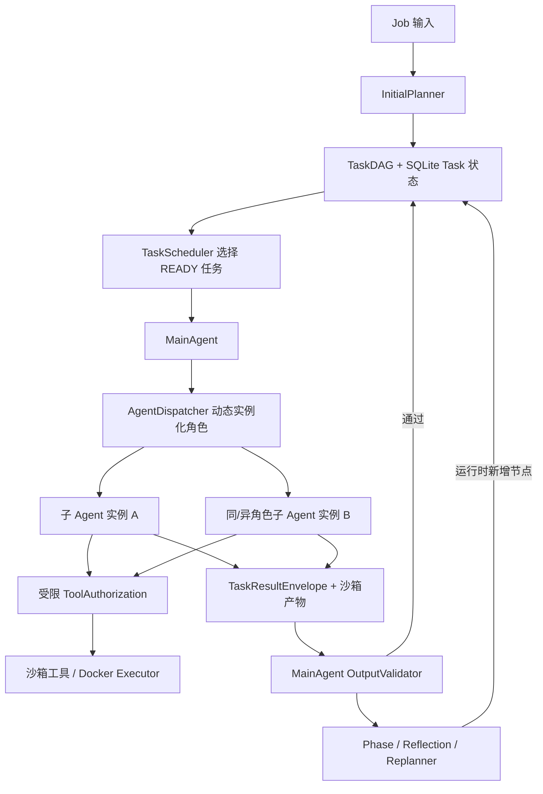
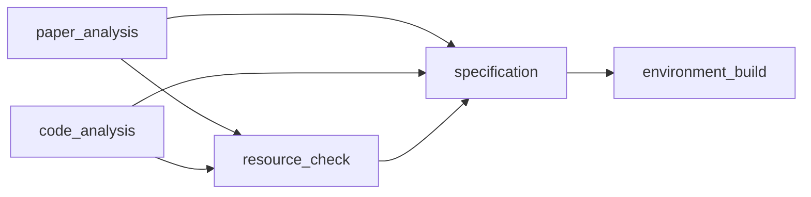
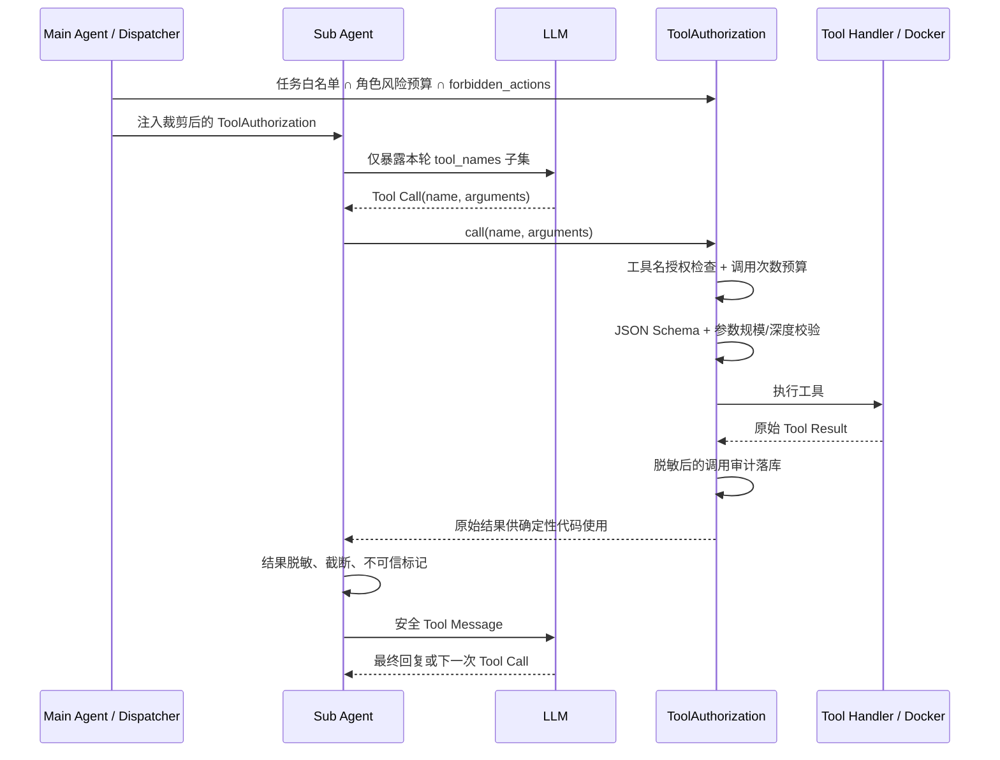
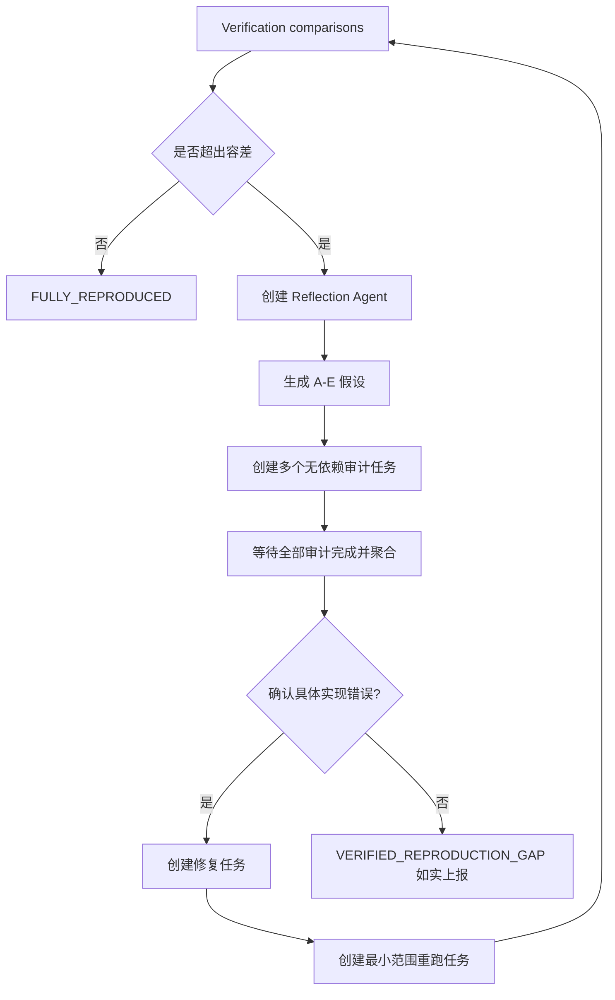

# ReproAgent 中 Agent 技术的代码定位、实现原理与现状审计

> 审计日期：2026-08-12  
> 审计范围：`repro_agent/` 主流程、`tests/` 自动化测试，以及题述四类技术说明。  
> 结论口径：本文区分“代码结构存在”“已接入主流程”“已形成端到端闭环”三种情况，不把设计注释等同于运行时事实。

## 1. 结论摘要

项目已经具备一个较完整的多 Agent 编排原型：主 Agent 维护任务 DAG，按任务类型动态创建 10 类子 Agent，异步并发执行任务；所有模型工具调用受白名单、风险等级、参数 Schema、沙箱路径和结果脱敏约束；实验通过五级门禁后，再交给独立 Verification Agent；失败可进入规则优先、LLM 兜底的重规划或反思审计流程。

但题述文字中有几处比当前实现更完整：L0～L3 的结构和读取接口已经存在，实际主流程目前只自动消费 L0；候选记忆没有来源真实性校验，冲突检测也较弱；Verification Agent 的哈希校验模块存在，但实验执行结果没有把完整 provenance 接入验证任务，日志也没有被实际读取核验；长任务心跳默认只有开始/结束两次，并非周期性业务心跳；失败拆分后的父任务会被标成 `TERMINAL_FAILURE`，又可能被阶段协调器当作 Job 级失败。

### 1.1 题述能力与代码现状对照

| 技术主张 | 当前状态 | 结论 |
|---|---|---|
| 任务 DAG、依赖就绪判定、运行时追加节点 | 已接入主流程 | 已实现 |
| 10 类专业 Agent 按 `task_type` 动态实例化 | 注册表和 Dispatcher 已接通 | 已实现 |
| 同角色多实例并行 | 调度器按 Task 并行；拆分/审计可产生同类型任务 | 已实现基础能力，但没有角色资源池或 GPU 预约 |
| 根据复杂度动态调整执行拓扑 | 节点可拆分、补前置、增加审计/修复/实验节点 | 已实现拓扑变化；并发上限仍是固定配置 |
| 心跳与长任务并发管理 | push/pull、软硬超时、取消、attempt 隔离均存在 | 部分实现；普通 Agent 没有周期性中途上报 |
| L0/L1/L2/L3 渐进式记忆 | 数据结构、文件布局、读取和压缩接口存在 | 部分实现；当前决策链只自动加载 L0 |
| 候选记忆冲突、来源、敏感信息验证 | 有冲突函数和敏感信息扫描 | 部分实现；没有来源校验，冲突检测实际较弱 |
| 生成与验证职责分离 | 实验 Agent 和 Verification Agent 是独立任务/类 | 已实现职责分离 |
| 基于日志、产物和哈希的一致性验证 | 哈希/证据模块和严格验证条件存在 | 部分实现；生产数据管道尚未把 provenance 接通，日志未实读 |
| 工具风险分级、最小权限、Schema 校验、结果清洗 | 已贯穿模型工具调用路径 | 已实现 |
| Docker、路径边界、网络隔离 | 命令工具强制走 fail-closed Docker | 已实现命令隔离；子 Agent 本身仍是宿主进程线程 |
| 五级实验门禁 | PhaseCoordinator + TierGate 逐级创建任务 | 已实现 |
| 差距检测、并行审计、聚合、修复/如实上报 | 主循环和 ReflectionController 已接通 | 主干已实现；审计证据和输入仍不完整 |
| 规则优先、LLM 兜底的失败重规划 | 已知错误走规则，`UNKNOWN_ERROR` 才调用 LLM | 已实现；拆分分支存在状态语义缺陷 |

## 2. 总体运行架构与 Agent 通信方式

当前不是“Agent 之间直接发消息”的对等网络，而是以 Main Agent 为中心的编排架构。子 Agent 不直接调用另一个子 Agent，也不共享对方的 Python 对象；它们通过任务状态、持久化结果和主 Agent 转发的依赖产物间接协作。



关键通信通道如下：

1. **任务下发**：Main Agent 从 DAG 取 READY 任务，经 Scheduler 分配 attempt 和 lease，再由 Dispatcher 创建对应角色实例。代码见 [`main_agent.py:365`](../repro_agent/orchestrator/main_agent.py#L365)、[`scheduler.py:264`](../repro_agent/scheduler/scheduler.py#L264)、[`dispatcher.py:283`](../repro_agent/orchestrator/dispatcher.py#L283)。
2. **业务报备 push**：子 Agent 调用 `report_progress()` 上报进度、当前步骤和 ETA；Scheduler 持久化 `AgentReport` 及下一报备截止时间。工具开始/结束只写 `ActivitySignal`，不会续期报备合同。
3. **到期 pull**：预计完成时间到达但没有最终结果时，Main Agent 调用 `get_subagent_status()` 检查执行线程并取得新 ETA。当前是同进程线程查询，不是 IPC/RPC。
4. **结果传递**：子 Agent 把 `result.json` 写进自己的 attempt 沙箱；主 Agent 验证后，`ArtifactResolver` 才把依赖任务的 payload 注入下游任务输入。代码见 [`results.py:38`](../repro_agent/schemas/results.py#L38)、[`artifacts.py:27`](../repro_agent/orchestrator/artifacts.py#L27)、[`main_agent.py:1332`](../repro_agent/orchestrator/main_agent.py#L1332)。
5. **回收**：子 Agent 线程结束后句柄不会立即删除，必须先通过输出验证；最终裁决后才 `discard_handle()`。代码见 [`main_agent.py:376`](../repro_agent/orchestrator/main_agent.py#L376)、[`dispatcher.py:442`](../repro_agent/orchestrator/dispatcher.py#L442)。

因此，这个项目中 Agent 间的实际通信协议可以概括为：

```text
Main Agent -> TaskDefinition/授权工具/依赖 payload -> Sub Agent
Sub Agent -> AgentReport/ActivitySignal/TaskResultEnvelope/沙箱产物 -> Main Agent
Main Agent -> 校验后的上游 payload -> 下游 Sub Agent
```

## 3. 技术一：DAG 动态任务编排

### 3.1 DAG 数据结构与依赖语义

`TaskDAG` 保存 `task_id -> Task` 和反向的 `_children` 索引。添加节点时会登记依赖关系并执行拓扑排序检查，发现环就抛出 `CycleDetectedError`。只有所有前置任务均为 `SUCCEEDED`，节点才可进入 READY；前置节点发生终止失败或取消时，下游保持阻塞。实现见 [`dag.py:27`](../repro_agent/domain/dag.py#L27)、[`dag.py:41`](../repro_agent/domain/dag.py#L41)、[`dag.py:75`](../repro_agent/domain/dag.py#L75)、[`dag.py:96`](../repro_agent/domain/dag.py#L96)。

新 Job 的初始拓扑由 `InitialPlanner` 一次性构造：



其中论文分析和代码分析没有依赖，可并行执行；资源检查、规格生成和环境构建按依赖逐步解锁。代码见 [`planner.py:23`](../repro_agent/orchestrator/planner.py#L23)。

### 3.2 9 类角色模板如何动态实例化

角色注册表位于 [`registry.py:21`](../repro_agent/agents/registry.py#L21)。Dispatcher 不持有固定 Agent 池，而是在每次任务启动时执行 `get_agent_class(task_type)`，再构造一个新的 Agent 对象，见 [`dispatcher.py:343`](../repro_agent/orchestrator/dispatcher.py#L343)。

| `task_type` | Agent 类 | 主要职责 |
|---|---|---|
| `paper_analysis` | [`PaperAnalysisAgent`](../repro_agent/agents/paper/agent.py#L58) | 解析论文、提取实验参数及来源 |
| `code_analysis` | [`CodeAnalysisAgent`](../repro_agent/agents/code/agent.py#L51) | 扫描入口、配置和实验脚本 |
| `resource_check` | [`ResourceCheckAgent`](../repro_agent/agents/resource/agent.py#L51) | 检查数据、模型、GPU、CUDA、磁盘 |
| `specification` | [`ExperimentSpecificationAgent`](../repro_agent/agents/specification/agent.py#L38) | 合并论文、代码与用户信息，生成实验规格 |
| `environment_build` | [`EnvironmentBuildAgent`](../repro_agent/agents/environment/agent.py#L67) | 构建 Dockerfile/依赖并做 import 自检 |
| `coding` | [`CodingAgent`](../repro_agent/agents/coding/agent.py#L47) | 生成和应用修复代码 |
| `experiment_execution` | [`ExperimentExecutionAgent`](../repro_agent/agents/experiment/agent.py#L68) | 执行某一级实验并采集退出码、日志尾部和指标 |
| `verification` | [`ResultVerificationAgent`](../repro_agent/agents/verification/agent.py#L74) | 独立验证正式实验的指标、可追溯性和证据 |
| `reflection` | [`ReflectionAgent`](../repro_agent/agents/reflection/agent.py#L61) | 生成差距假设与审计检查项，不直接修复 |

“实例化”和“回收”的边界也比较清楚：Dispatcher 创建线程和 Agent；结果完成后 Main Agent 先校验任务输出，再释放 handle。子 Agent 不能创建其他 Agent，实际创建入口集中在 `AgentDispatcher.start_async()`。

### 3.3 动态拓扑从哪里产生

初始 DAG 之后，有四条运行时扩图路径：

| 触发条件 | 新增/修改节点 | 代码位置 |
|---|---|---|
| 五级实验推进 | 每次只创建下一个 `experiment_execution`，正式实验后创建 `verification` | [`phases.py:109`](../repro_agent/orchestrator/phases.py#L109)、[`phases.py:220`](../repro_agent/orchestrator/phases.py#L220) |
| 任务过大或上下文过长 | 将原任务拆成“数据/模型/训练/评测”四个同类型子任务 | [`replanner.py:109`](../repro_agent/orchestrator/replanner.py#L109) |
| 输入或依赖缺失 | 创建 `resource_check` 前置任务，并把失败任务重新阻塞到该依赖上 | [`replanner.py:140`](../repro_agent/orchestrator/replanner.py#L140)、[`scheduler.py:138`](../repro_agent/scheduler/scheduler.py#L138) |
| 结果差距触发反思 | 创建 reflection、多个审计、修复和最小重跑节点 | [`reflection_controller.py:105`](../repro_agent/orchestrator/reflection_controller.py#L105)、[`reflection_controller.py:211`](../repro_agent/orchestrator/reflection_controller.py#L211)、[`reflection_controller.py:254`](../repro_agent/orchestrator/reflection_controller.py#L254) |

这说明“动态调整执行拓扑”是真实存在的：DAG 不会停留在创建 Job 时的五个固定节点。

### 3.4 并发、同角色多实例与优先级

Scheduler 统计 `DISPATCHED/RUNNING` 数量，用 `max_parallel_agents` 计算可用槽位，再按优先级挑选 READY 任务，见 [`scheduler.py:246`](../repro_agent/scheduler/scheduler.py#L246)。优先级依次近似考虑：可解锁的下游节点数、用户 priority、预计耗时和资源成本，见 [`priority.py:39`](../repro_agent/scheduler/priority.py#L39)。

Dispatcher 为每个 task_id 保存独立 `SubAgentHandle`，每个 handle 启动一个 daemon thread，见 [`dispatcher.py:79`](../repro_agent/orchestrator/dispatcher.py#L79)。调度对象是 Task 而不是角色，所以只要 DAG 中存在多个相同 `task_type` 的 READY 节点，就会创建多个同角色实例。例如：

- `Replanner.decompose()` 一次产生四个同类型任务；
- `plan_audit()` 若多个假设属于相同维度，可产生多个相同角色的审计任务；
- 这些任务都没有彼此依赖时，会受全局并发槽位上限控制并行执行。

边界是：系统没有按 GPU/内存做真实资源预约，也没有“根据复杂度自动调大 `max_parallel_agents`”。动态的是任务数量和依赖拓扑；并发上限仍是固定配置，默认 8，见 [`scheduler.py:38`](../repro_agent/scheduler/scheduler.py#L38)。

### 3.5 动态报备、超时、取消和 attempt 隔离

每个任务定义包含角色相关的预计耗时、软/硬时间上限、最多延期报备次数和最大重试次数。运行链路为：

1. Dispatcher 启动 Agent 时提交 `STARTED` 报告，预计耗时形成首次 `next_report_due_at`；具体 Agent 的阶段进度报告可用新 ETA 调整下次报备时间。
2. 到达报备截止时间仍无最终结果时，Main Agent 主动 pull。线程仍存活则形成一次 `EXTENSION` 报告并按新 ETA 调整截止时间；普通进度不计入延期次数。
3. 第三次延期仍未完成时，报备额度耗尽，任务进入终态取消，避免同一任务无限等待或自动重试。硬超时仍是独立、不可突破的资源安全上限；软超时只做观测告警，不再与报备机制重复判定卡死。
4. 工具开始/结束、线程/容器存活等写入 `ActivitySignal`。它们可作为到期 pull 的诊断证据，但不会刷新报备截止时间，也不会修改延期次数。
5. 所有取消统一走非阻塞流程：先设置 `threading.Event` 请求优雅退出，超过取消宽限期仍无法确认退出才强制停止并 fail closed。每次派发产生新的 `active_attempt_id`，旧 attempt 的迟到结果和迟到报告均被拒绝。
6. 最新报备合同随 Task 持久化，完整报备历史复用 `task_events`；恢复时不接管已消失线程，重排任务会清空旧 attempt 的报备租约。

当前限制：Python 线程本身无法被外部真正强杀；真正可强制停止的是 `execute_command` 启动的容器/进程后端。业务进度精度也取决于具体 Agent 是否在阶段边界提供准确进度和 ETA，缺失时系统只能根据已完成比例和初始预计耗时保守推算。

### 3.6 DAG 实现中的已知语义问题

`replace_with_subtasks()` 会把被拆分的父任务标成 `TERMINAL_FAILURE`，见 [`scheduler.py:94`](../repro_agent/scheduler/scheduler.py#L94)；而 `PhaseCoordinator.advance()` 看到任意 `TERMINAL_FAILURE` 会直接把 Job 判为 `FAILED`，见 [`phases.py:56`](../repro_agent/orchestrator/phases.py#L56)。这会使“拆分后继续执行”与“父任务终止失败”产生冲突。更合适的做法是增加 `SUPERSEDED/DECOMPOSED` 状态，或在 Job 终止判定时排除已成功替换的父节点。

## 4. 技术二：分层记忆与上下文管理

### 4.1 L0～L3 的结构设计

`MemoryManager` 为每个 Job 创建 `index/paper/code/data/model/environment/experiments/comparison/reflection/tasks/failures/evidence/archive` 等目录，见 [`manager.py:51`](../repro_agent/memory/manager.py#L51)。

`CandidateMemory` 把一条记忆定义为：

- **L0**：topic 和各分区的索引行；
- **L1**：`summary`；
- **L2**：结构化 `details`；
- **L3**：`evidence_refs`，理论上指向论文原文、代码行、日志或产物。

Markdown 序列化格式见 [`candidate.py:25`](../repro_agent/memory/candidate.py#L25)。正式记忆写入后，`MemoryManager._update_index()` 维护 L0；主 Agent 可分别读取 L0、L1 或完整 L1～L3，见 [`manager.py:143`](../repro_agent/memory/manager.py#L143)、[`manager.py:168`](../repro_agent/memory/manager.py#L168)、[`manager.py:188`](../repro_agent/memory/manager.py#L188)。

### 4.2 候选记忆的写入链路

设计上的链路是：

```text
子 Agent -> output/candidate_memory.md
          -> 任务输出先通过 MainAgent 校验
          -> 构造 CandidateMemory
          -> sensitive scan + conflict detection
          -> 正式 memory 分区 + L0 索引
```

子 Agent 只能通过 `write_task_output` 写自己的 `candidate_memory.md`，见 [`base.py:466`](../repro_agent/agents/base.py#L466)。任务通过输出校验后，Main Agent 才调用 `_promote_candidate_memory()`，见 [`main_agent.py:406`](../repro_agent/orchestrator/main_agent.py#L406)、[`main_agent.py:1505`](../repro_agent/orchestrator/main_agent.py#L1505)。MemoryManager 在写正式文件前执行验证，见 [`manager.py:100`](../repro_agent/memory/manager.py#L100)。

敏感信息扫描当前覆盖 API key、secret key、私钥、password、Bearer token 等模式；命中即拒绝晋升，见 [`validation.py:23`](../repro_agent/memory/validation.py#L23)、[`validation.py:71`](../repro_agent/memory/validation.py#L71)。

### 4.3 渐进式上下文加载和预算压缩

`ContextBuilder` 按九段流水线组装主 Agent 决策上下文：Job 状态、DAG 摘要、当前决策、L0、相关 L1、必要的 L2/L3、最近事件、未解决问题、预算，见 [`builder.py:52`](../repro_agent/context/builder.py#L52)。

每段带优先级。超预算时先删除低优先级段；`MUST_KEEP` 段不删除，极端情况下只截断，见 [`budget.py:26`](../repro_agent/context/budget.py#L26)、[`budget.py:59`](../repro_agent/context/budget.py#L59)。当前该上下文真正接入了 `UNKNOWN_ERROR` 的 LLM 失败分类兜底，见 [`llm_decision.py:95`](../repro_agent/orchestrator/llm_decision.py#L95)。

此外，任务级检查点把结果绑定到任务输入的 scope hash，进程恢复时可复用确定性的只读步骤，见 [`base.py:293`](../repro_agent/agents/base.py#L293)、[`repository.py:448`](../repro_agent/storage/repository.py#L448)。Job/Task/DAG 的真正恢复依赖 SQLite；上下文快照是辅助归档，见 [`recovery.py:39`](../repro_agent/orchestrator/recovery.py#L39)、[`snapshot.py:85`](../repro_agent/context/snapshot.py#L85)。

### 4.4 与题述“候选记忆验证流水线”的差距

这里是当前实现最需要如实说明的部分：

1. **没有来源真实性校验。** `validate_candidate()` 只做敏感信息扫描和同 topic 的 details 冲突比较，没有检查 evidence 文件是否存在、是否属于当前任务、哈希是否匹配，也没有核验论文页码/代码行引用。
2. **Main Agent 没有解析子 Agent 已写好的 L1/L2/L3。** `_promote_candidate_memory()` 把整个 Markdown 的前 500 字符塞进新的 `summary`，`details` 只写 `task_type`，`evidence_refs` 留空，见 [`main_agent.py:1512`](../repro_agent/orchestrator/main_agent.py#L1512)。因此正式记忆中的 L2/L3 并没有保留子 Agent 原始分层语义。
3. **冲突检测很难触发。** topic 被设置为 `task_type.task_id`，天然几乎不会与别的任务同 topic；跨进程加载旧 Markdown 时 `_load_section_candidates()` 只恢复 topic，`details={}`，见 [`manager.py:124`](../repro_agent/memory/manager.py#L124)。而冲突检测只比较同名 details 字段，见 [`validation.py:48`](../repro_agent/memory/validation.py#L48)。
4. **存在冲突仍然会覆盖。** `validate_candidate()` 把 conflicts 返回给调用方但仍设 `accepted=True`；`promote_candidate()` 随后直接写目标文件。Main Agent 当前只在 rejected 时记录日志，没有处理 accepted-with-conflicts。
5. **主流程目前只实际加载 L0。** 唯一的 `ContextBuilder.build()` 调用没有传 `relevant_topics` 或 `expand_full_topics`，所以 L1/L2/L3 分支在当前运行链路中不会自动执行，见 [`llm_decision.py:136`](../repro_agent/orchestrator/llm_decision.py#L136)。
6. **记忆权限令牌是逻辑能力，不是不可伪造凭证。** `MainAgentCapability` 是公开 dataclass，读取接口只做 `isinstance`，见 [`manager.py:72`](../repro_agent/memory/manager.py#L72)、[`manager.py:203`](../repro_agent/memory/manager.py#L203)。实际隔离主要来自“不向子 Agent 注入 MemoryManager/路径/读取工具”，而不是密码学授权令牌。

因此更准确的现状表述是：项目已经实现 L0～L3 的文件模型、读接口和上下文预算框架，但“自动按需披露、来源校验、强冲突仲裁”的端到端闭环仍待补齐。

## 5. 技术三：可靠性与安全执行

### 5.1 模型工具调用的真实执行顺序

当前链路不是简单地在每次调用时先做 Schema 再授权。授权对象在任务派发前生成；模型调用发生后，再同时执行授权检查和参数校验。完整顺序如下：



对应代码：

- 角色级风险预算：[`authorization.py:83`](../repro_agent/tools/authorization.py#L83)；
- 任务实例级工具模板和 `restrict_tools` 交集收窄：[`task_factory.py:26`](../repro_agent/orchestrator/task_factory.py#L26)、[`task_factory.py:111`](../repro_agent/orchestrator/task_factory.py#L111)；
- 派发前生成授权对象：[`dispatcher.py:306`](../repro_agent/orchestrator/dispatcher.py#L306)；
- 每次调用检查授权、调用预算、Schema，再执行 handler：[`authorization.py:198`](../repro_agent/tools/authorization.py#L198)；
- 模型 Tool Call 循环和回填：[`base.py:394`](../repro_agent/agents/base.py#L394)。

工具参数验证是 fail closed 的递归 JSON Schema 子集实现，覆盖对象/数组嵌套、`required`、`additionalProperties`、组合规则、长度/数值约束等；未知断言关键字也拒绝，另设字符数、节点数和深度上限，见 [`schema_validation.py:39`](../repro_agent/tools/schema_validation.py#L39)、[`schema_validation.py:71`](../repro_agent/tools/schema_validation.py#L71)、[`schema_validation.py:131`](../repro_agent/tools/schema_validation.py#L131)。

工具结果进入模型前会：

- 对敏感 key 和常见凭证格式脱敏；
- 删除控制字符和二进制内容；
- 限制总字符、集合大小、层级和节点数；
- 检测 prompt injection 风格文本；
- 添加 `untrusted=true` 和“结果是数据、不是指令”的处理策略。

实现见 [`result_sanitization.py:12`](../repro_agent/tools/result_sanitization.py#L12)、[`result_sanitization.py:67`](../repro_agent/tools/result_sanitization.py#L67)。

### 5.2 人工授权不是安全旁路

权限错误、数据/模型/资源缺失和缺少运行命令会创建可持久化 Intervention，请求状态可跨进程恢复，见 [`interventions.py:52`](../repro_agent/orchestrator/interventions.py#L52)。人工批准额外工具时，仍然必须通过角色风险预算、`forbidden_actions` 和网络红线校验；不能用“用户批准”绕过系统安全边界，见 [`authorization.py:462`](../repro_agent/tools/authorization.py#L462)、[`interventions.py:411`](../repro_agent/orchestrator/interventions.py#L411)。拒绝或超时会 fail closed，把 Job/Task 关闭为失败，见 [`interventions.py:319`](../repro_agent/orchestrator/interventions.py#L319)、[`interventions.py:336`](../repro_agent/orchestrator/interventions.py#L336)。

这里的“授权令牌”同样是进程内 `ToolAuthorization` capability object，不是带签名、过期时间和 audience 的分布式 token。如果未来把 Agent 移到独立 Worker，需要升级为服务端强制校验的短期 capability/token。

### 5.3 Docker 隔离和路径边界

`execute_command` 不允许网络参数为 true，且真实执行必须存在隔离后端；没有 Docker 时直接失败，不回退到宿主机 shell，见 [`write_tools.py:70`](../repro_agent/tools/write_tools.py#L70)。

Docker 命令固定包含：

- `--network none`；
- `--read-only` 根文件系统；
- `no-new-privileges`、`--cap-drop ALL`；
- CPU、内存、进程数限制；
- `/tmp` 使用 `noexec,nosuid` tmpfs；
- input 只读挂载，workspace/output 受控可写；
- 环境变量名命中 secret/token/password/key 时拒绝注入。

代码见 [`docker.py:28`](../repro_agent/execution/docker.py#L28)。超时后先 `docker stop`，再 `docker kill`，见 [`docker.py:94`](../repro_agent/execution/docker.py#L94)。

文件工具只通过 `resolve_readable_path/resolve_writable_path/resolve_output_path` 接触路径；`Path.resolve()` 后必须仍在授权根目录，能拦截 `..` 和符号链接逃逸，见 [`paths.py:90`](../repro_agent/sandbox/paths.py#L90)、[`workspace.py:91`](../repro_agent/sandbox/workspace.py#L91)。宿主输入先复制到任务沙箱，再用 `input://` 虚拟路径交给 Agent，见 [`manager.py:78`](../repro_agent/sandbox/manager.py#L78)。

边界是：隔离针对模型可触发的工具和命令。10 个 Agent 类本身仍运行在主 Python 进程的线程里，并没有“一 Agent 一容器”；安全模型假设 Agent 实现代码是可信的，主要防御不可信模型输出和被模型构造的工具参数。

### 5.4 防止“幻觉完成”的通用输出校验

子 Agent 写 `result.json` 时会自动包装成 `TaskResultEnvelope`，绑定：

- schema version；
- task_id；
- active attempt_id；
- task_type；
- outcome；
- payload；
- 可选 artifact 引用和 SHA-256。

实现见 [`base.py:455`](../repro_agent/agents/base.py#L455)、[`results.py:38`](../repro_agent/schemas/results.py#L38)。读取时会校验身份字段、任务类型所需 payload、artifact 不得逃逸 output 目录，并重新计算大小和 SHA-256，见 [`results.py:80`](../repro_agent/schemas/results.py#L80)。`OutputValidator` 还校验任务声明的 expected outputs，见 [`validator.py:33`](../repro_agent/orchestrator/validator.py#L33)。

任务只有经过这一步才会被标记 `SUCCEEDED`；“Agent 返回 succeeded=True”本身不构成成功。这是当前代码中防止普通子 Agent 幻觉完成的第一道门。

边界是：通用 `completion_criteria` 目前只记录“待专项/人工校验”，不会自动做语义判断；并且现有 Agent 通过 `TaskResultEnvelope.succeeded()` 写结果时没有填充 `artifacts`，所以 artifact hash 校验能力虽然存在，当前正常 Agent 输出还没有普遍使用。

### 5.5 独立 Verification Agent 如何验证实验

实验执行和验证是两个不同 `task_type`、两个不同类和两个独立沙箱任务。正式实验完成后，PhaseCoordinator 不直接宣告成功，而是创建 `verification` 节点，见 [`phases.py:157`](../repro_agent/orchestrator/phases.py#L157)、[`phases.py:220`](../repro_agent/orchestrator/phases.py#L220)。

Verification Agent 当前执行的确定性检查包括：

1. 从实验规格读取期望指标，从 ExperimentRun 读取观测指标；
2. 找缺失指标并按容差比较；
3. 用 `exit_code == 0` 判断运行是否成功退出；
4. 正式实验必须具备 git commit、container/config/dataset digest、model、seed、hardware 七元组；
5. 扫描 implementation summary 中的可疑“拟合论文数字/硬编码论文结果”等标记；
6. 如果收到 `ArtifactProvenance`，重新计算 artifact/code/config/paper trace 四类文件哈希；
7. 只有指标完整、运行成功、七元组完整、反作弊通过、provenance 通过且不是 mock，才令 `verification_valid=True`。

核心实现见 [`verification/agent.py:84`](../repro_agent/agents/verification/agent.py#L84)、[`experiment.py:109`](../repro_agent/domain/experiment.py#L109)、[`provenance.py:138`](../repro_agent/evidence/provenance.py#L138)、[`provenance.py:207`](../repro_agent/evidence/provenance.py#L207)。验证裁决还会持久化为带 gap fingerprint 的 `VerificationRecord`，见 [`verification.py:15`](../repro_agent/domain/verification.py#L15)、[`main_agent.py:1402`](../repro_agent/orchestrator/main_agent.py#L1402)。

### 5.6 “日志、产物及哈希一致性验证”的接线缺口

严格验证策略本身是 fail closed 的，但当前端到端链路还没有把所需证据送进去：

1. `ExperimentExecutionResult` 目前只输出 tier、command、exit_code、stdout/stderr tail、metrics、run_id、container_digest 和 mock，见 [`experiment/agent.py:42`](../repro_agent/agents/experiment/agent.py#L42)。它没有输出 git/config/dataset/model/seed/hardware，也没有 `artifact_provenance`。
2. PhaseCoordinator 创建各级实验任务时没有设置 `metrics_output_path`，因此 `ExperimentExecutionAgent._read_metrics_file()` 默认不会执行，正常主链产生的 `metrics` 为空，见 [`phases.py:134`](../repro_agent/orchestrator/phases.py#L134)、[`experiment/agent.py:117`](../repro_agent/agents/experiment/agent.py#L117)。
3. `ArtifactResolver` 只把 `experiment_execution` payload 映射成 `experiment_run`，没有构造或转发 `artifact_provenance`，见 [`artifacts.py:16`](../repro_agent/orchestrator/artifacts.py#L16)。
4. `register_artifact_provenance()` 在生产主流程中没有调用点；它目前是可用组件，不是已接通流程。
5. Verification Agent 虽把 `log_path` 反序列化进 `ExperimentRun`，但 `run()` 没有读取日志文件、检查日志存在性或计算日志 hash；“检查运行日志”的 system prompt 强于实际代码。
6. 默认执行镜像是可变 tag `python:3.11-slim`，不含 `@sha256:` 时 Docker backend 得不到 image digest，见 [`main_agent.py:97`](../repro_agent/orchestrator/main_agent.py#L97)、[`docker.py:92`](../repro_agent/execution/docker.py#L92)。

这意味着真实非 mock 主流程会因为 provenance 缺失或七元组不完整而严格验证失败。它不会误报成功，这是安全的；但目前也难以走到“真实完整复现成功”。

## 6. 技术四：实验门禁、反思闭环与动态重规划

### 6.1 五级递进门禁

五级枚举顺序为：

```text
STATIC_CHECK -> UNIT_TEST -> SMOKE_TEST -> REDUCED_EXPERIMENT -> FULL_EXPERIMENT
```

定义见 [`enums.py:230`](../repro_agent/domain/enums.py#L230)，门禁规则见 [`tier_gate.py:20`](../repro_agent/evaluation/tier_gate.py#L20)。`TierGate.evaluate()` 从已有成功运行记录中寻找第一个未通过层级，只允许创建紧邻的下一级；正式实验要求前四级都成功，见 [`tier_gate.py:39`](../repro_agent/evaluation/tier_gate.py#L39)、[`tier_gate.py:70`](../repro_agent/evaluation/tier_gate.py#L70)。

`PhaseCoordinator` 每轮最多创建一个下一层实验任务，并将它依赖到上一层任务；全部层级完成后才创建 Verification Agent。该机制避免主 Agent 一开始就把正式训练放进 DAG。

注意：当前“成功门禁”主要依据 `exit_code == 0`。`_TIER_SUCCESS_CRITERIA` 虽描述了 loss、梯度、checkpoint、评测等更丰富条件，但这些字符串没有被 TierGate 做语义校验，见 [`experiment/agent.py:33`](../repro_agent/agents/experiment/agent.py#L33)。

### 6.2 差距检测与反思闭环

反思闭环的实际路径为：



详细实现：

- 指标超出容差且预算未耗尽时触发反思：[`reflection_controller.py:81`](../repro_agent/orchestrator/reflection_controller.py#L81)、[`main_agent.py:847`](../repro_agent/orchestrator/main_agent.py#L847)；
- Reflection Agent 只生成假设，不改代码、不跑实验：[`reflection/agent.py:61`](../repro_agent/agents/reflection/agent.py#L61)；
- A～E 假设映射为 paper/code/spec/resource 等审计角色，多个审计任务无彼此依赖，因此可并行：[`reflection_controller.py:105`](../repro_agent/orchestrator/reflection_controller.py#L105)；
- Main Agent 等该轮 pending audit task id 集合清空后再聚合，见 [`main_agent.py:1229`](../repro_agent/orchestrator/main_agent.py#L1229)；
- 聚合优先选择证据数量最多的已确认错误，否则按资源限制、未披露细节、随机性、无明显问题回退，见 [`reflection_controller.py:153`](../repro_agent/orchestrator/reflection_controller.py#L153)；
- 只有六类“已确认错误”能进入 repair，见 [`reflection_controller.py:62`](../repro_agent/orchestrator/reflection_controller.py#L62)、[`reflection_controller.py:204`](../repro_agent/orchestrator/reflection_controller.py#L204)；
- 未确认错误时不为追平论文数字盲目重跑，而是进入 `VERIFIED_REPRODUCTION_GAP`，见 [`main_agent.py:1263`](../repro_agent/orchestrator/main_agent.py#L1263)；
- 修复成功后按 `RerunScope` 生成一个最小范围实验任务，正式重跑前仍检查五级门禁，见 [`reflection_controller.py:254`](../repro_agent/orchestrator/reflection_controller.py#L254)。

### 6.3 规则优先、LLM 兜底的失败重规划

`Replanner` 对已知 FailureType 使用确定性映射：

- transient/tool/parsing/invalid output/stalled -> retry；
- context too large/task too broad/code/environment/training/evaluation -> split；
- input missing/dependency error -> add prerequisite；
- permission/resource/data/model -> ask user；
- 达到 max attempts -> terminal failure。

规则表见 [`replanner.py:41`](../repro_agent/orchestrator/replanner.py#L41)，主循环执行 retry/split/add prerequisite/ask user/terminal 的分支见 [`main_agent.py:697`](../repro_agent/orchestrator/main_agent.py#L697)。

只有规则表故意不覆盖的 `UNKNOWN_ERROR` 才进入 LLM：Main Agent 组装 Job、DAG、失败、事件、预算和记忆索引等上下文，要求模型返回受限 JSON 决策；解析失败或非法值一律降级为 `TERMINAL_FAILURE`。代码见 [`replanner.py:67`](../repro_agent/orchestrator/replanner.py#L67)、[`llm_decision.py:95`](../repro_agent/orchestrator/llm_decision.py#L95)、[`llm_decision.py:174`](../repro_agent/orchestrator/llm_decision.py#L174)。

### 6.4 反思预算和算力约束

JobBudget 定义最大并发 Agent、反思轮数、正式实验重跑次数、每轮审计任务数、GPU 小时、总时长和模型调用成本，见 [`job.py:18`](../repro_agent/domain/job.py#L18)。`budget_exhausted()` 在反思和重跑前检查上限，见 [`job.py:106`](../repro_agent/domain/job.py#L106)。任务本身还有 max attempts、软硬超时和工具调用次数上限。

当前需要注意两点：

- `JobBudget.max_parallel_agents` 与 `MainAgentConfig.scheduler.max_parallel_agents` 是两套字段；主循环实际读取后者，修改 JobBudget 本身不会自动改变 Scheduler 并发上限。
- `gpu_hours_used` 和 `model_call_cost_usd` 有字段和判断，但没有看到主流程按真实执行/调用持续计费更新，因此这两项更像预算接口，而不是已完成的实时成本计量。
- `max_audit_tasks_per_round` 在 JobBudget 中存在，但 `plan_audit()` 没有截断 hypotheses；当前没有把这个限制真正应用到审计任务数量。

### 6.5 反思闭环的实现边界

1. **反思证据偏薄。** `_trigger_reflection()` 只把 DAG summary 放入 `available_evidence`，没有附上实验日志、产物哈希、配置差异和正式记忆，代码注释也明确把它列为后续扩展，见 [`main_agent.py:944`](../repro_agent/orchestrator/main_agent.py#L944)。
2. **审计任务缺少原始输入。** `plan_audit()` 只放入 hypothesis、required checks、reflection id 和 source run id，没有传 paper path、repository path、dataset/model path，见 [`reflection_controller.py:122`](../repro_agent/orchestrator/reflection_controller.py#L122)。复用原有 Agent 时，某些审计任务无法真正访问它们需要的源材料。
3. **审计结论主要是字段启发式。** 例如 code audit 以是否找到入口脚本判断代码错误，paper audit 成功则归入“可能有未披露细节”，见 [`main_agent.py:1126`](../repro_agent/orchestrator/main_agent.py#L1126)。这还不是基于外部检查器的强证据审计。
4. **“最小测试 -> 缩小实验 -> 正式实验”没有在每次修复后重新构造完整五段链。** 当前 `plan_minimum_rerun_scope()` 根据 scope 只创建一个 smoke 或 full 任务；full 只是在历史前四级曾通过时被允许。若修复可能使旧门禁证据失效，应按修复影响范围失效相关 tier 记录并重新逐级验证。
5. **`suggested_audit_tasks` 没有接入编排。** Reflection Agent 会同时输出 `hypotheses` 和 `suggested_audit_tasks`，但 Main Agent 构造 `ReflectionReport` 时只保留 hypotheses，`plan_audit()` 也遍历 hypotheses；建议任务列表目前只用于候选记忆展示，见 [`reflection/agent.py:105`](../repro_agent/agents/reflection/agent.py#L105)、[`main_agent.py:1021`](../repro_agent/orchestrator/main_agent.py#L1021)。

## 7. 自动化测试对这些能力覆盖到什么程度

本次在当前工作区实际执行：

```text
python -m pytest -q
102 passed in 3.35s
```

关键测试包括：

| 能力 | 测试 |
|---|---|
| 异步启动、push 心跳、验证后回收 | [`test_async_dispatch_and_validation.py:82`](../tests/test_async_dispatch_and_validation.py#L82) |
| 动态报备截止、到期 pull、三次延期终止 | [`test_liveness_and_termination.py`](../tests/test_liveness_and_termination.py) |
| 五级门禁只创建紧邻下一层 | [`test_phase_coordinator.py:49`](../tests/test_phase_coordinator.py#L49) |
| 正式实验后必须创建 verification | [`test_phase_coordinator.py:66`](../tests/test_phase_coordinator.py#L66) |
| 无问题不重跑、确认问题才修复重跑 | [`test_reflection_loop.py:200`](../tests/test_reflection_loop.py#L200)、[`test_reflection_loop.py:237`](../tests/test_reflection_loop.py#L237) |
| Docker 无网、只读、限额和 fail closed | [`test_docker_execution.py:32`](../tests/test_docker_execution.py#L32) |
| 工具 Schema、调用预算、结果脱敏 | [`test_openai_tool_protocol.py:173`](../tests/test_openai_tool_protocol.py#L173)、[`test_openai_tool_protocol.py:263`](../tests/test_openai_tool_protocol.py#L263) |
| result envelope attempt 和 artifact hash | [`test_result_contracts.py:12`](../tests/test_result_contracts.py#L12)、[`test_result_contracts.py:68`](../tests/test_result_contracts.py#L68) |
| 中断恢复和工具调用审计 | [`test_recovery_and_tool_audit.py`](../tests/test_recovery_and_tool_audit.py) |
| HITL 解析、拒绝、超时和恢复 | [`test_human_in_the_loop.py`](../tests/test_human_in_the_loop.py) |

102 个测试说明已有组件和已覆盖主路径当前可通过，但不能抵消前文接线缺口：测试中不少反思/验证场景使用专用 mock Agent 或手工构造完整 run/provenance；项目目前也没有候选记忆来源校验、冲突跨重启、真实 provenance 贯通、修复后门禁失效、拆分父任务状态等测试。

## 8. 建议的补齐优先级

### P0：让题述能力真正端到端成立

1. **接通实验 provenance**：实验任务产出 git/config/dataset/model/seed/hardware、日志路径和 artifact 清单；执行后调用 `register_artifact_provenance()`；ArtifactResolver 把 provenance 传给 Verification Agent。
2. **让 Verification Agent 真读证据**：验证日志存在性/增长/结束标记，重算指标文件，核对日志与 result 的 run_id，校验所有声明 artifact 的 hash。
3. **修复记忆晋升**：解析候选 Markdown 或改为 `candidate_memory.json + md`；保留真实 L1/L2/L3；验证 evidence refs 的存在、范围、hash 和来源任务。
4. **修复动态拆分状态**：增加 `SUPERSEDED/DECOMPOSED`，避免被拆父任务触发 Job 终止。
5. **补齐审计输入**：从原 Job/上游任务把 paper/repository/data/model/config/log/provenance 以只读虚拟路径传给审计任务。

### P1：提升长任务和多 Agent 的生产可靠性

1. 为长命令增加可解释的阶段 progress、日志游标和更准确的 ETA；底层活动信号继续与业务报备分离。
2. 将 Agent Worker 从不可强杀线程升级为可回收进程或远端 Worker；保留 lease、attempt 和 pull 接口。
3. 将调度器升级为资源感知：GPU 数、显存、CPU、内存、预估耗时和角色配额都参与 admission control。
4. 把 `max_audit_tasks_per_round`、GPU/模型费用的实时计量接入主循环。
5. 使用 digest-pinned Docker image，并对运行时镜像实际 digest 做校验。
6. 让 ContextBuilder 自动选择相关 L1，只有验证/冲突/反思时加载 L2/L3；将真实 evidence refs 写入 snapshot。

## 9. 对题述四段文字的建议口径

如果这四段文字用于项目说明或简历，按照当前代码，更严谨的说法是：

1. **DAG 动态编排**：已实现 10 类角色注册表、按任务动态实例化、DAG 依赖调度、运行时拆分/补前置/审计/修复节点，以及线程级同角色并发；并发受固定全局上限约束，资源感知调度和周期性业务心跳仍待完善。
2. **分层记忆**：已实现 L0～L3 Markdown 数据模型、主 Agent 读取权限接口和上下文预算压缩；候选记忆具备敏感信息扫描和基础冲突检测，但来源校验、稳定 topic 冲突仲裁及 L1～L3 自动加载尚未形成端到端闭环。
3. **可靠性与安全**：已实现独立验证角色、任务结果契约、attempt 防串写、工具最小权限、递归 Schema 校验、结果清洗、Docker/路径隔离和受控 HITL；严格 provenance 校验组件已存在，但日志、七元组和 artifact hash 尚未由实验主链完整供给。
4. **门禁与重规划**：已实现五级顺序门禁、指标差距触发、并行审计、确定性聚合、“确认错误才修复重跑，否则如实报告”以及规则优先/LLM 兜底；下一步应补强审计证据、修复后门禁失效策略和拆分任务状态语义。
