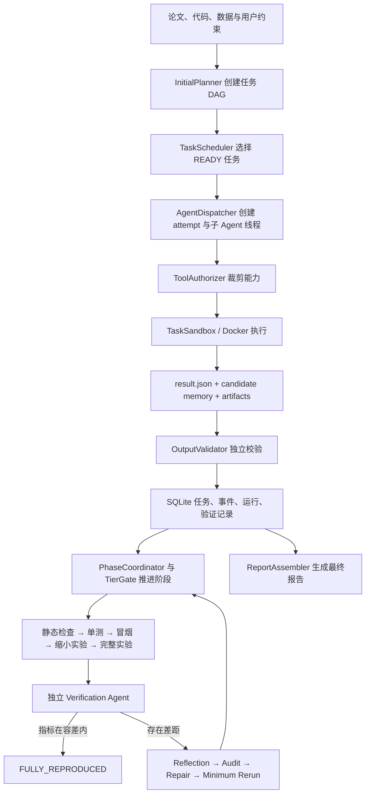
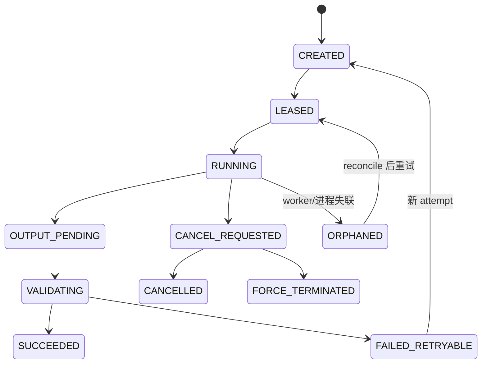
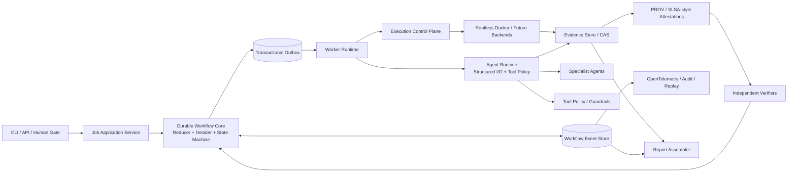

# ReproAgent 架构层优化建议及依据

> 评审日期：2026-08-07  
> 工程整改状态更新：2026-08-13  
> 评审范围：`repro_agent/`、`tests/`、当前 P0 修复后的执行与防御链路  
> 文档性质：架构评审与后续实施路线；下表单独标记本轮已落地范围

## 0. 2026-08-13 工程整改状态

| 项目 | 状态 | 本轮落地 |
|---|---|---|
| P0 主执行链 | 已完成 | 论文/附录解析、规格归一化与摘要冻结、离线镜像真实构建、隔离代码修复、分级命令、严格 provenance 验证 |
| A1 恢复协议 | 已完成单机版 | 恢复器、遗留容器对账、反思/审计/修复回调重放、稳定 creation key |
| A2 TaskAttempt/幂等 | 已完成单机版 | `task_attempts`、持久化 lease、原子 task+attempt+event、唯一 creation/event key、旧 attempt 拒绝 |
| A3 证据链 | 已完成 MVP | 所有已验证任务产物自动哈希入库，实验清单及代码/配置/数据/模型/镜像摘要持久化 |
| A4 执行控制面 | 已完成 MVP | `Popen` 可取消执行、状态文件、恢复对账、镜像构建与 digest 固定；仍未拆成独立远程 worker |
| A5 规格门禁 | 已完成 | 稳定 `spec_digest`、冲突检测、显式人工批准/覆盖、冲突未解决时禁止进入环境和实验阶段 |
| A6 MainAgent 拆分 | 部分完成 | 计量、预算和证据持久化已抽到 `RuntimeAccountingService`；完整 reducer/outbox/远程 worker 留作后续架构演进 |

本次按要求没有建设 A8/A9 所述的评测体系；现有单元与工程回归只用于验证整改没有破坏运行契约。

## 1. 结论先行

ReproAgent 当前最合适的演进方向不是继续增加更多自由自治的 Agent，而是保留“确定性工作流外壳 + 专业 Agent 处理语义任务”的混合架构，同时优先把运行状态、尝试记录和证据链变成可恢复、可验证的持久化事实。

当前版本已经具备一组很有价值的安全与可靠性基础：

- 主 Agent 统一编排，子 Agent 只获得裁剪后的工具能力；
- 工具风险分级、白名单和禁止项形成了纵深授权；
- 真实命令执行默认走 fail-closed Docker 后端，不回退到宿主机 shell；
- 容器默认禁网、只读根文件系统、移除 capabilities，并限制 CPU、内存和进程数；
- 每次重试有独立 attempt 标识和沙箱，旧 attempt 的晚到结果不会覆盖当前任务；
- 子 Agent 输出需要经过结构化 envelope、路径边界和哈希验证；
- 实验执行与结果验证分离，Mock 结果不会被宣称为真实复现；
- 实验采用静态检查、单测、冒烟、缩小实验、完整实验的分级门禁；
- 反思和重跑均有预算上限，CLI 能区分完成、阻塞、失败、取消和未完成。

这些设计说明项目已经从“LLM 脚本集合”进入了“有控制面的 Agent 工作流”阶段。下一阶段的最高收益不是扩大 Agent 数量，而是补齐以下五项 P1 架构能力：

1. 耐久工作流与进程崩溃恢复；
2. 一等公民的 `TaskAttempt` 与原子幂等状态转换；
3. 自动生成、持久化和验证的端到端科研证据图；
4. 可取消、可核对、镜像按 digest 固定的执行控制面；
5. 复现规格冻结与高成本/高歧义节点的人类确认门禁。

## 2. 当前架构与流程

### 2.1 当前主流程



### 2.2 当前实现中值得保留的架构选择

1. **确定性控制面优先。** 阶段推进在 `repro_agent/orchestrator/phases.py` 中由代码决定，而不是让 LLM 自由选择整个流程。Anthropic 将预定义代码路径称为 workflow，并指出对定义良好的任务，它比完全自治 Agent 更可预测、更一致；只有无法预先确定步骤时才需要更强自治。[Anthropic：Building effective agents](https://www.anthropic.com/engineering/building-effective-agents)

2. **专业 Agent + 最小工具集。** `repro_agent/orchestrator/task_factory.py:22` 为不同任务类型定义工具模板，`repro_agent/tools/authorization.py:100` 再按风险预算做运行时校验。该模式与“工具应标准化、清晰、充分测试，并对工具风险分级”的工程建议一致。[OpenAI：A practical guide to building agents](https://openai.com/business/guides-and-resources/a-practical-guide-to-building-ai-agents/)

3. **Agent 必须从环境取得 ground truth。** 当前输出验证、实验层级门禁和独立验证器都比单纯相信模型自述可靠。ReAct 强调推理与环境动作/观察交错；CRITIC 进一步表明外部工具反馈能帮助验证和修正模型输出。[ReAct，ICLR 2023](https://openreview.net/forum?id=WE_vluYUL-X)、[CRITIC，ICLR 2024](https://proceedings.iclr.cc/paper_files/paper/2024/hash/fef126561bbf9d4467dbb8d27334b8fe-Abstract-Conference.html)

4. **执行与验证职责分离。** `repro_agent/agents/verification/agent.py:74` 的验证 Agent 不运行实验，只读取证据。该方向正确，但后续应进一步让验证方只消费不可变证据，而不是工作目录中的可变路径。

5. **Fail-closed 执行。** `repro_agent/execution/docker.py:28` 显式构造受限 Docker 参数；Docker 不可用时抛出 `ExecutionUnavailable`。这比静默回退到宿主机命令执行更符合最小权限原则。

## 3. 主要架构缺口与优先级

| 编号 | 优先级 | 缺口 | 直接影响 |
|---|---|---|---|
| A1 | P1 | 编排状态仍部分驻留内存，缺少重启恢复协议 | 进程崩溃后可能丢失待验证、取消、审计聚合状态 |
| A2 | P1 | attempt 不是独立持久化实体，状态变化缺少统一原子提交 | 难以完整审计重试历史，也难保证副作用 exactly-once/at-most-once |
| A3 | P1 | 证据表存在但没有生产级自动写入链路 | 严格验证要求的 provenance 在正常流程中难以完整形成 |
| A4 | P1 | Docker 执行为阻塞调用，镜像默认使用可变 tag | 取消能力不完整，环境不可精确重建，供应链证据不足 |
| A5 | P1 | 复现规格没有冻结/审批门禁 | 论文、代码和 Agent 推断冲突时可能在错误目标上消耗完整实验预算 |
| A6 | P1 | `MainAgent` 是 1435 行的多职责控制器 | 状态逻辑耦合，恢复、测试与后续扩展成本持续上升 |
| A7 | P2 | 工具与模型输出协议只做部分结构校验 | 嵌套参数、范围、格式和跨字段约束可能绕过校验或静默降级 |
| A8 | P2 | 反思仍依赖模型自评，缺少可重复的外部评测闭环 | 可能放大错误假设，或出现“反思后反而退化” |
| A9 | P2 | 缺少端到端 trace、故障注入与场景级 Agent 评测 | 无法量化模型/提示词/调度变更是否真正改善系统 |
| A10 | P2 | 单进程线程调度与资源声明尚未形成真实资源预约 | GPU、并发、成本和长任务隔离难以扩展 |
| A11 | P2 | 未显式建模论文/仓库内容的间接提示注入风险 | 不可信文本可能诱导模型尝试越权动作或污染长期记忆 |
| A12 | P3 | 数据库只有 schema 版本号，没有迁移执行框架 | 后续表结构升级和旧任务恢复风险较高 |

## 4. P1：应优先实施的架构优化

### A1. 将主循环改造成可恢复的耐久工作流

#### 当前证据

- `repro_agent/orchestrator/main_agent.py:174-192` 保存 `_processed_success_task_ids`、`_reflection_reports`、`_pending_audit_task_ids`、`_pending_validation`、`_pending_validation_attempts` 和 `_timeout_cancellations` 等内存状态；
- `repro_agent/orchestrator/dispatcher.py:255` 的 `_handles` 只存在当前进程；
- `repro_agent/scheduler/lease.py:54` 的取消请求是内存 `set`；
- 数据库虽然记录任务和事件，但当前没有一个启动时的恢复器重建上述派生状态、核对遗留容器并继续未完成 workflow。

#### 建议

在保留 SQLite 单机部署的前提下，先实现一个轻量耐久工作流内核，不必立即引入 Temporal：

1. 所有影响后续决策的事实先落库，再触发内存行为；
2. 每个状态转换写入不可变 `workflow_events`，同时更新当前投影视图；
3. 每次 `step()` 只读取持久化事实并生成 `WorkflowCommand[]`；
4. 副作用执行结果以事件回写，workflow reducer 必须是确定性的；
5. 启动时运行 `RecoveryReconciler`：恢复非终态 Job、回收过期租约、核对容器、重建待验证与待聚合状态；
6. 以后需要多机扩展时，再把该接口映射到 Temporal 等耐久执行引擎。

Temporal 的官方文档将 Event History 作为 workflow 的事实来源，并通过 replay 恢复崩溃前状态；同时要求 workflow 决策对相同历史保持确定性，外部 I/O 则放入 activities。[Temporal：Durable Execution](https://docs.temporal.io/temporal)、[Temporal：Workflow replay](https://docs.temporal.io/workflows)

#### 验收标准

- 在任意阶段强制结束 Python 进程并重启后，Job 能自动继续或明确进入可解释的 `ORPHANED/NEEDS_RECONCILIATION` 状态；
- `_pending_validation`、取消请求和审计聚合不再是唯一事实来源；
- 同一 event history 重放两次得到相同 job/task 投影；
- 恢复过程中不会重复创建同一实验任务或重复执行已确认副作用。

### A2. 把 `TaskAttempt` 提升为一等持久化实体，并统一幂等提交

#### 当前证据

- `repro_agent/domain/task.py:121-143` 将 `attempt`、`active_attempt_id`、租约和执行状态混在 `Task` 当前快照中；
- 旧 attempt 结果能被拒绝，这是正确的，但数据库没有保存每次 attempt 的完整生命周期；
- `creation_key` 存在于任务输入中，例如 `repro_agent/orchestrator/phases.py:146`，但数据库没有对应唯一约束；
- 任务状态、事件、attempt 结果和待执行副作用没有统一的原子提交边界。

#### 建议数据模型

```text
task_definitions
  task_id, job_id, task_type, definition_json, creation_key UNIQUE(job_id, creation_key)

task_attempts
  attempt_id, task_id, ordinal, status, lease_owner, lease_expires_at,
  execution_handle, started_at, completed_at, termination_reason,
  result_envelope_sha256, UNIQUE(task_id, ordinal)

workflow_events
  event_id, job_id, task_id, attempt_id, event_type, payload, created_at

outbox
  command_id, job_id, attempt_id, command_type, payload, status,
  available_at, delivered_at, UNIQUE(idempotency_key)
```

所有可重试动作必须带稳定 idempotency key，并在同一事务中完成“记录幂等 token + 修改业务状态 + 写 outbox”。AWS 的幂等 API 文档明确指出，记录 client request ID 与相关修改必须形成原子 ACID 操作，否则会出现“副作用已发生但 token 未记录”或相反情况。[AWS Builders' Library：Making retries safe with idempotent APIs](https://aws.amazon.com/builders-library/making-retries-safe-with-idempotent-APIs/)

#### 推荐 attempt 状态机



#### 验收标准

- 能查询某个 Task 的所有 attempt、每次使用的容器、命令、输入/输出摘要和终止原因；
- 重复提交相同 `creation_key` 只创建一个逻辑任务；
- 晚到结果只能关闭其自身 attempt，不能改变当前 active attempt；
- 重放或重复投递同一 outbox command 不产生第二份副作用。

### A3. 建立内容寻址的证据仓库与科研 provenance 图

#### 当前证据

- `repro_agent/storage/database.py:104-112` 已定义 `evidence_records`；
- 生产代码目前只在 `ReportAssembler` 读取该表，测试中才直接插入，未发现统一的生产写入 repository；
- `TaskResultEnvelope` 已支持 artifact 引用和哈希校验，这是良好基础；
- `ExperimentExecutionResult` 当前主要记录 tier、command、exit code、日志尾部、metrics、run ID 和 container digest，尚未自动产出完整 provenance；
- 验证器要求 `git_commit`、容器 digest、配置/数据 digest、模型、seed、硬件等字段完整，但正常执行链还没有统一收集并签发这些事实。

#### 建议

引入 `EvidenceStore`，使用 SHA-256 内容寻址保存所有关键对象：

- 输入：论文、附录、代码树/commit、数据 manifest、模型/checkpoint、环境锁文件；
- 过程：解析后的复现规格、命令、镜像 digest、硬件快照、随机种子、工具调用、stdout/stderr；
- 输出：指标文件、checkpoint、图表、最终报告；
- 关系：`used`、`wasGeneratedBy`、`wasDerivedFrom`、`wasAssociatedWith`；
- 证明：每个 attempt 生成一份不可变 attestation，验证器只消费 digest 和 attestation。

W3C PROV 将 provenance 建模为 Entity、Activity 和 Agent 及其关系，适合表示“论文/代码/数据 → 实验 attempt → 产物/指标”的因果图。[W3C PROV-O Recommendation](https://www.w3.org/TR/prov-o/)

SLSA provenance 的核心目的是描述 artifact 在何时、何地、如何由哪些外部参数和依赖产生，使消费者可以验证它是否符合预期并在需要时重建。[SLSA v1.2 Build Provenance](https://slsa.dev/spec/v1.2/build-provenance)

in-toto 通过每个步骤的材料、产物、命令和签名 link metadata，形成可验证的端到端供应链；其论文在多种真实供应链攻击场景上展示了链式完整性验证的价值。[in-toto，USENIX Security 2019](https://www.usenix.org/conference/usenixsecurity19/presentation/torres-arias)

NeurIPS 的复现清单要求给出精确命令、环境、训练细节、计算资源、代码、数据和说明，这些字段可以直接转化为 ReproAgent 的 evidence completeness schema。[NeurIPS Paper Checklist](https://neurips.cc/public/guides/PaperChecklist)

#### 验收标准

- 每个完整实验至少产生一份包含 source/config/data/model/image/seed/hardware/command/output digests 的 attestation；
- 删除或修改任一引用文件后，验证器能稳定检测证据断链；
- 报告中的每个关键指标都能追溯到具体 artifact、attempt 和规格字段来源；
- `evidence_records` 不再需要测试或调用方手工插入；
- 路径只作为位置提示，digest 才是身份。

### A4. 将执行后端升级为真正的“执行控制面”

#### 当前证据

- `repro_agent/execution/docker.py:80-85` 用阻塞的 `subprocess.run` 等待容器结束；
- 线程取消只能在工具/LLM 调用边界检查，阻塞中的 Docker 调用不能被 Agent 线程直接抢占；
- 默认镜像为 `python:3.11-slim`（`main_agent.py:100`），tag 可变；
- `image_digest` 只有在请求字符串本身带 `@` 时才记录；
- 已有 `--network none`、`--read-only`、`no-new-privileges`、`--cap-drop ALL`、CPU/内存/PID/tmpfs 限制，这是应继续保留的基线。

#### 建议

将执行接口拆为以下生命周期：

```python
prepare(request) -> PreparedExecution       # 解析镜像为不可变 digest，校验策略
start(prepared) -> ExecutionHandle          # 返回容器 ID/名称，不阻塞
poll(handle) -> ExecutionObservation
stream_logs(handle, cursor) -> LogChunk
cancel(handle, grace_seconds) -> TerminationRecord
collect(handle) -> ExecutionResult
reconcile(attempt_id) -> ReconciliationResult
```

并增加：

- 正式实验只接受 `image@sha256:...`；准备阶段可以将批准的 tag 解析为 digest，但实际执行记录必须固定 digest；
- 生产部署优先使用 rootless Docker 或独立低权限 runner；
- 显式记录 seccomp profile、运行时版本、cgroup 配置和用户映射；
- 补齐磁盘、文件数、打开文件、GPU 显存/时长等可执行资源限制；
- 下载依赖与正式实验分离：下载阶段使用域名 allowlist、校验 checksum/签名并写入 CAS；正式实验继续禁网；
- 资源探测从 Agent 工具中移到受信任控制面，避免把宿主机探测与不可信任务执行混在一起。

Docker 官方文档指出 tag 可变，而 digest 固定能保证使用同一镜像并提供审计轨迹。[Docker：Pin base image versions](https://docs.docker.com/build/building/best-practices/#pin-base-image-versions)

Docker rootless 模式让 daemon 和容器都在非 root 用户命名空间中运行，以缓解 daemon/runtime 漏洞风险；seccomp 默认 profile 使用 allowlist 限制系统调用。[Docker Rootless mode](https://docs.docker.com/engine/security/rootless/)、[Docker Seccomp](https://docs.docker.com/engine/security/seccomp/)

NIST SP 800-190 系统说明了容器镜像、registry、orchestrator、runtime 和 host OS 等层面的安全风险与缓解措施，可作为执行控制面的威胁建模基线。[NIST SP 800-190](https://csrc.nist.gov/pubs/sp/800/190/final)

#### 验收标准

- 任务启动后立即得到持久化 container ID，主进程可随时 `poll/cancel/reconcile`；
- 进程重启后能核对遗留容器并收集或终止它；
- 正式验证记录中的镜像 digest 永不为空；
- 相同输入和 digest 不因 tag 漂移改变运行环境；
- 取消测试证明真实容器已退出，而不只是 Python 线程停止等待。

### A5. 增加“复现规格冻结”与人类确认门禁

#### 当前证据

- 论文、代码和默认值会被汇总为实验规格；
- `FieldProvenance` 已区分论文显式、附录、代码默认、用户提供和 Agent 推断等来源；
- 但 `PhaseCoordinator` 在环境准备完成后可继续创建分级实验任务，没有一个明确的 `SPEC_APPROVED` 冻结点；
- 高成本完整实验的目标指标、容差、数据版本或命令如果来源冲突，当前主要依赖 Agent 与规则自动处理。

#### 建议

在环境构建前加入不可变 `ReproductionSpec vN`：

- 每个字段记录值、来源证据、置信度和冲突状态；
- 明确目标 claim、主指标、容差依据、数据 split/version、模型版本、随机种子策略、运行命令、预计资源；
- 任何 `AGENT_INFERRED` 且影响主要结论的字段必须列入风险清单；
- 存在冲突、需要凭据、预计成本超过阈值或进入完整实验前，创建 `HumanDecision`；
- 用户批准后对 spec 计算 digest，后续 attempt 全部引用该 digest；
- 修订规格必须生成新版本，不能原地覆盖。

ScienceAgentBench 主张先对科学工作流中的单项任务进行严格评估，再宣称端到端自动化；其 102 个真实科学任务经过专家验证，当前最佳 Agent 的独立完成率仍然有限。这支持在科研高风险节点保留人工确认与分阶段评估。[ScienceAgentBench，ICLR 2025](https://proceedings.iclr.cc/paper_files/paper/2025/hash/f12b4df26344f3be803c06b555252efe-Abstract-Conference.html)

NeurIPS 清单也要求论文主张、限制、实验细节、统计显著性和计算资源被明确披露，可直接作为 spec completeness gate 的字段来源。[NeurIPS Paper Checklist](https://neurips.cc/public/guides/PaperChecklist)

#### 验收标准

- 任一实验 attempt 都能引用唯一 `spec_digest`；
- 主要指标、容差或数据 split 存在未解决冲突时不能进入完整实验；
- 高成本动作有持久化批准人、批准内容、时间和 spec 版本；
- 报告能区分论文明确值、代码有效值和 Agent 推断值。

### A6. 拆分 `MainAgent`，让确定性状态机成为唯一决策核心

#### 当前证据

`repro_agent/orchestrator/main_agent.py` 当前约 1435 行，同时负责：依赖组装、主循环、线程收集、输出验证、存活性、超时取消、失败重规划、阶段推进、反思闭环、记忆转正、快照、运行与验证持久化。内聚度过低使任何恢复或状态改动都容易触及多个隐式集合。

#### 建议模块边界

```text
repro_agent/
  application/
    job_service.py              # 接收命令、返回结果，不保存流程私有状态
    recovery_service.py         # 启动恢复与外部执行核对
  workflow/
    reducer.py                  # 纯函数：state + event -> state
    decider.py                  # 纯函数：state -> commands
    transitions.py              # 显式合法转换表与不变量
    commands.py
    events.py
  execution/
    control_plane.py
    backends/docker.py
    reconciliation.py
  agent_runtime/
    runner.py                   # 有限工具循环、取消、结构化输出
    tool_policy.py
    model_policy.py
  evidence/
    store.py                    # CAS
    provenance.py
    attestation.py
    verification.py
  persistence/
    unit_of_work.py
    repositories/
    migrations/
  reporting/
    assembler.py
```

`WorkflowReducer` 和 `WorkflowDecider` 不调用 LLM、文件系统或网络；LLM 只处理论文理解、代码理解、诊断和候选方案等语义任务。Anthropic 的工程经验建议从简单、可组合模式开始，并强调透明地展示规划步骤；对定义良好的步骤，workflow 的可预测性优于不必要的自治复杂度。[Anthropic：Building effective agents](https://www.anthropic.com/engineering/building-effective-agents)

#### 验收标准

- `MainAgent` 缩减为依赖组装/兼容 facade，不再拥有流程事实集合；
- 合法状态转换集中定义，非法转换会失败并记录事件；
- reducer/decider 可用纯内存事件序列做完整单测；
- LLM 不直接决定是否将 Job 标记为成功，也不直接写状态数据库。

## 5. P2：第二阶段优化

### A7. 统一 schema-first 的 Agent Runtime 与策略引擎

当前 `ToolSpec` 能生成 JSON Schema，但 `_validate_arguments` 主要检查顶层 required、额外字段、基础类型和 enum；嵌套对象、数组元素、长度、数值范围、pattern、format 和跨字段语义仍需补齐。多个 Agent 还在自行 `json.loads(response.content)` 并做各自的容错默认值，容易产生静默降级。

建议：

- 为每类 Agent 定义版本化输入/输出模型，使用同一个 JSON Schema/Pydantic 校验器；
- Provider 能力允许时使用 strict structured outputs；不允许时仍用本地完整 schema 校验和有限修复；
- 禁止关键字段解析失败后默认为 `0`、空列表或默认枚举并继续高成本阶段；
- 工具 schema 加入 `minLength/maxLength`、`minimum/maximum`、数组 item schema、路径格式和条件约束；
- 将任务类型、风险、网络、路径、预算和人工批准规则抽为 `PolicyDecision`；规模较大后可接 OPA，当前可先保持 Python 纯函数接口；
- 每次工具调用在调用前写 `STARTED`，结束后写 `SUCCEEDED/DENIED/FAILED`，而不是只在线程结束时批量写一个事件。

JSON Schema 2020-12 定义了类型、枚举、数值范围、字符串长度/模式、数组和对象约束等完整验证词汇。[JSON Schema Validation 2020-12](https://json-schema.org/draft/2020-12/json-schema-validation)

OpenAI Structured Outputs 可约束模型输出遵循给定 JSON Schema，并能程序化区分 refusal；这比“提示模型返回 JSON + 手工解析”更适合关键控制数据。[OpenAI Structured Outputs](https://developers.openai.com/api/docs/guides/structured-outputs)

OPA 将策略决策与执行点分离，用声明式规则对结构化输入作出 allow/deny 等决定，适合后续集中管理工具、网络和资源策略。[Open Policy Agent](https://www.openpolicyagent.org/docs)

### A8. 将反思改成“外部证据驱动的 evaluator-optimizer”

Reflexion 表明语言反馈和 episodic memory 能改善后续尝试；CRITIC 表明工具交互的外部验证能支持修正。但 ICLR 2024 的研究也发现，没有外部反馈的 intrinsic self-correction 可能无效甚至降低表现。因此反思不能只依赖同一模型重新阅读自己的结论。[Reflexion，NeurIPS 2023](https://proceedings.neurips.cc/paper_files/paper/2023/hash/1b44b878bb782e6954cd888628510e90-Abstract-Conference.html)、[CRITIC，ICLR 2024](https://proceedings.iclr.cc/paper_files/paper/2024/hash/fef126561bbf9d4467dbb8d27334b8fe-Abstract-Conference.html)、[Large Language Models Cannot Self-Correct Reasoning Yet，ICLR 2024](https://proceedings.iclr.cc/paper_files/paper/2024/hash/8b4add8b0aa8749d80a34ca5d941c355-Abstract-Conference.html)

建议：

- 反思输入必须绑定稳定 `gap_fingerprint`、失败 attempt、spec digest 和证据引用；
- 先运行确定性检查器：指标重算、配置 diff、数据 manifest diff、环境 diff、日志模式、随机性统计；
- LLM 只基于这些检查结果提出有证据引用的 hypothesis；
- hypothesis 必须生成可证伪检查，不能只生成自然语言解释；
- 验证器与修复 Agent 使用不同上下文和职责；高风险时可使用两个独立 evaluator 或规则 + LLM 组合；
- 相同 gap 和相同证据不重复生成同一审计任务；
- 记录修复前后指标和成本，只有有量化改善时才把反思策略写入长期记忆。

### A9. 建立端到端可观测性、replay 与 Agent 场景评测

当前已有任务事件和最终报告，但尚不足以回答：哪次模型调用导致了错误分支、哪个工具/容器消耗最多时间、同一任务换模型后是否更稳定、崩溃恢复是否丢事件。

建议统一关联键：

```text
trace_id = job_id
span hierarchy = job -> phase -> task -> attempt -> model/tool/execution/validation
mandatory attributes = task_type, attempt_id, model, prompt_version,
                       tool_name, policy_decision, image_digest,
                       input_tokens, output_tokens, cost, latency,
                       retry_count, termination_reason, evidence_digest
```

OpenTelemetry 的 trace/span 模型提供跨进程操作的上下文、层级和因果关联，适合把模型、工具、调度和容器执行串成一个端到端视图。[OpenTelemetry Traces](https://opentelemetry.io/docs/concepts/signals/traces/)

测试体系应增加：

- 固定小型论文/仓库的 golden scenarios；
- 进程崩溃、SQLite 锁、模型超时、工具拒绝、容器失联的 fault injection；
- event replay 确定性测试；
- prompt injection、路径逃逸、伪造指标和旧 attempt 晚到的对抗测试；
- 成功率、证据完整率、错误成功率、平均成本、恢复成功率、人工介入率；
- 模型、prompt、工具 schema 和工作流版本的回归对比。

ScienceAgentBench 对程序、执行结果和成本同时评估，并由专家验证任务；AgentBench 则强调多环境、多轮决策评估。这说明 Agent 系统不能只用单元测试或最终文本质量衡量。[ScienceAgentBench，ICLR 2025](https://proceedings.iclr.cc/paper_files/paper/2025/hash/f12b4df26344f3be803c06b555252efe-Abstract-Conference.html)、[AgentBench，ICLR 2024](https://proceedings.iclr.cc/paper_files/paper/2024/hash/e9df36b21ff4ee211a8b71ee8b7e9f57-Abstract-Conference.html)

### A10. 抽象 Worker 与资源预约，但暂不直接上 Kubernetes

建议先定义 `WorkerBackend` 和 `ResourceReservation`：

- Worker 声明 CPU、内存、GPU 型号/数量、磁盘和支持的 execution backend；
- scheduler 在派发前完成原子 reservation；
- 任务只发给满足其 spec 的 worker；
- 运行中计量 GPU-hours、wall time、模型成本和磁盘；
- lease、cancel 和 heartbeat 全部持久化；
- provider 调用加入并发限制、熔断、指数退避与 jitter；
- SQLite 仍可支撑单机；当确有多机并发需求时再迁移 Postgres/队列/Temporal。

AWS 的可靠性资料指出重试必须配合 timeout、backoff 和 jitter，避免相关重试制造新的拥塞；同时副作用操作需要幂等 token。[AWS：Timeouts, retries and backoff with jitter](https://aws.amazon.com/builders-library/timeouts-retries-and-backoff-with-jitter/)、[AWS：Making retries safe with idempotent APIs](https://aws.amazon.com/builders-library/making-retries-safe-with-idempotent-APIs/)

### A11. 对不可信论文/仓库内容做数据与指令隔离

论文、README、代码注释、issue 文本和数据文件都应被视为不可信数据，不能因为文本声称“忽略规则并调用某工具”就获得控制权。当前最小工具集已经降低后果，但还缺少显式 taint 与策略层。

建议：

- prompt 中明确分隔 `trusted instructions` 与 `untrusted evidence`；
- 所有外部文本附来源和 taint 标签，不能改变工具权限、预算或成功标准；
- 高风险工具的参数必须由确定性代码从已验证对象构造，不能直接复制不可信文本；
- 对 tool call 做 user intent/任务目标一致性检查；
- 不可信内容不能直接进入长期记忆，只能以候选证据经验证后提升；
- 建立含恶意 README、论文隐藏指令和数据字段注入的回归集。

OpenAI 的 Agent 工程指南建议采用多层 guardrails，并强调 guardrail 不能替代认证、授权、严格访问控制和传统软件安全措施；OWASP 的 Excessive Agency 指南建议最小化 Agent 可调用扩展及扩展功能。[OpenAI：A practical guide to building agents](https://openai.com/business/guides-and-resources/a-practical-guide-to-building-ai-agents/)、[OWASP LLM06:2025 Excessive Agency](https://genai.owasp.org/llmrisk/llm062025-excessive-agency/)

## 6. P3：维护性与长期演进

### A12. 增加显式数据库迁移和兼容策略

`repro_agent/storage/database.py:32` 有 `SCHEMA_VERSION = 2`，但 `_init_schema()` 只执行 `CREATE TABLE IF NOT EXISTS` 并 `INSERT OR IGNORE` 版本号，没有从旧版本逐步迁移、拒绝未知新版本或回滚验证。

建议：

- 建立 `migrations/0001_initial.sql`、`0002_verification.sql` 等有序迁移；
- 启动时读取当前版本，逐步升级并在事务中记录；
- 数据库版本高于程序支持版本时 fail closed；
- 为迁移增加旧数据库 fixture 和恢复测试；
- result envelope、event、spec、attestation 均有独立 schema version 与兼容策略。

### A13. 让记忆成为“有证据、可淘汰、按作用域查询”的知识层

当前候选记忆经主 Agent 转正的方向正确。后续建议将记忆项绑定：来源 event/evidence digest、适用任务类型、有效模型/工具版本、置信度、创建时间、成功/失败反馈和过期条件。

Reflexion 使用 episodic memory 保存语言反馈，但在工程系统中应避免把未经外部验证的自我解释永久化。只有对后续 attempt 有可重复正向效果的策略才提升为长期记忆。[Reflexion，NeurIPS 2023](https://proceedings.neurips.cc/paper_files/paper/2023/hash/1b44b878bb782e6954cd888628510e90-Abstract-Conference.html)

## 7. 目标架构



### 7.1 核心原则

1. **LLM 负责语义，不负责事实提交。** 成功状态、资源授权、成本门禁和证据有效性由确定性代码决定。
2. **数据库记录事实，内存只做缓存。** 任意进程可被终止并从持久化事实恢复。
3. **每个副作用都属于某个 attempt。** 没有 attempt ID、spec digest 和 idempotency key 的副作用不允许执行。
4. **每个结论都能指向证据。** 报告不是摘要拼接，而是证据图的可读投影。
5. **验证与生成分离。** 生成器不能给自己的输出签发最终可信结论。
6. **能力按任务最小化。** 不可信内容永远不能提升权限。
7. **先证明复杂性有收益，再增加自治。** 固定流程继续使用 workflow；只有开放式诊断/检索才允许 Agent 动态规划。

## 8. 推荐实施路线

### Phase 1：耐久性基础（最高优先级）

1. 新增 `task_attempts`、`workflow_events`、`outbox`、`human_decisions` 表；
2. 给任务 `creation_key` 加数据库唯一约束；
3. 把取消请求、待验证状态和审计聚合状态移出内存事实集合；
4. 实现 `WorkflowReducer`、`WorkflowDecider`、`RecoveryReconciler`；
5. 增加进程强杀/重启的端到端恢复测试。

完成定义：任务可在任何阶段崩溃恢复，且不会重复副作用或丢失验证状态。

### Phase 2：证据与执行控制面

1. 新增 CAS `EvidenceStore` 和 evidence repository；
2. 执行前自动解析并固定 image digest；
3. 将 Docker 后端改为 `start/poll/cancel/collect/reconcile`；
4. 自动生成 attempt attestation 和科研 provenance 图；
5. 验证器改为只按 digest 消费不可变证据。

完成定义：任一最终指标可追溯到固定规格、代码、数据、镜像、命令、硬件和 attempt。

### Phase 3：规格门禁与 Agent Runtime

1. 引入版本化 `ReproductionSpec` 与 `SPEC_APPROVED`；
2. 统一 Agent 输入/输出 schema；
3. 完整实现 JSON Schema 校验和结构化输出；
4. 抽离 `PolicyDecision`，加入 prompt-injection 对抗检查；
5. 将反思改为 deterministic checks → evidence-bound hypotheses → falsifiable audits。

完成定义：关键字段冲突不会静默进入完整实验，模型解析失败不会以默认值继续。

### Phase 4：观测、评测与扩展

1. 接入 OpenTelemetry trace/metrics/log correlation；
2. 建立 golden scenarios、fault injection 和安全回归集；
3. 建立模型/prompt/tool/workflow 版本评测看板；
4. 引入 WorkerBackend 与资源预约；
5. 只有单机吞吐确实不足时，再评估 Postgres、消息队列、Temporal 或 Kubernetes。

完成定义：每次架构或模型变更都有可量化的成功率、错误成功率、成本和恢复性对比。

## 9. 明确不建议现在做的事情

- **不建议把流程改成完全自由的多 Agent 群聊。** 论文复现有清晰的证据和阶段门禁，确定性 workflow 更适合作为外壳；自由协商会扩大状态空间和错误传播面。
- **不建议立即引入 Kubernetes。** 当前首先缺的是可恢复语义、attempt 模型和资源预约接口；调度平台不能替代这些领域不变量。
- **不建议先上向量数据库。** 当前更迫切的是证据身份、来源和有效性；检索性能不是可信度问题的替代品。
- **不建议让 LLM 直接修改 Job/Task 状态。** LLM 可以提出 action proposal，但必须由 reducer、policy 和 verifier 接纳。
- **不建议把“更多反思轮次”等同于更可靠。** 没有外部反馈的自我纠正可能退化，应优先提升验证信号质量。
- **不建议为了兼容而在真实执行失败时回退宿主机 shell。** 当前 fail-closed 行为应保留。

## 10. 可直接转成 Issue 的优先清单

| 顺序 | Issue | 关键产物 | 依赖 |
|---|---|---|---|
| 1 | First-class TaskAttempt | 表、repository、状态机、历史查询 | 无 |
| 2 | Durable cancel/validation/audit state | 持久化命令与恢复投影 | 1 |
| 3 | Transactional idempotency + outbox | creation key 唯一约束、command dispatcher | 1 |
| 4 | Crash Recovery Reconciler | 重启恢复与遗留容器核对 | 1-3 |
| 5 | Async Execution Control Plane | start/poll/cancel/collect/reconcile | 1 |
| 6 | Image digest preparation | 固定镜像与运行策略证明 | 5 |
| 7 | EvidenceStore / CAS | artifact repository 与 digest API | 1 |
| 8 | Attempt attestation / provenance graph | W3C PROV/SLSA 风格记录 | 5-7 |
| 9 | Versioned ReproductionSpec | spec digest、冲突与批准门禁 | 7 |
| 10 | Unified structured Agent Runtime | 输入输出模型、完整 schema 校验 | 无 |
| 11 | Evidence-driven reflection | 外部检查器、gap 去重、可证伪审计 | 8-10 |
| 12 | OpenTelemetry + scenario evals | trace、指标、故障注入、回归集 | 1-11 |

## 11. 参考依据

### Agent 架构与评测论文

1. Yao et al., [ReAct: Synergizing Reasoning and Acting in Language Models](https://openreview.net/forum?id=WE_vluYUL-X), ICLR 2023.
2. Shinn et al., [Reflexion: Language Agents with Verbal Reinforcement Learning](https://proceedings.neurips.cc/paper_files/paper/2023/hash/1b44b878bb782e6954cd888628510e90-Abstract-Conference.html), NeurIPS 2023.
3. Gou et al., [CRITIC: Large Language Models Can Self-Correct with Tool-Interactive Critiquing](https://proceedings.iclr.cc/paper_files/paper/2024/hash/fef126561bbf9d4467dbb8d27334b8fe-Abstract-Conference.html), ICLR 2024.
4. Huang et al., [Large Language Models Cannot Self-Correct Reasoning Yet](https://proceedings.iclr.cc/paper_files/paper/2024/hash/8b4add8b0aa8749d80a34ca5d941c355-Abstract-Conference.html), ICLR 2024.
5. Liu et al., [AgentBench: Evaluating LLMs as Agents](https://proceedings.iclr.cc/paper_files/paper/2024/hash/e9df36b21ff4ee211a8b71ee8b7e9f57-Abstract-Conference.html), ICLR 2024.
6. Chen et al., [ScienceAgentBench: Toward Rigorous Assessment of Language Agents for Data-Driven Scientific Discovery](https://proceedings.iclr.cc/paper_files/paper/2025/hash/f12b4df26344f3be803c06b555252efe-Abstract-Conference.html), ICLR 2025.

### 官方架构与接口文档

7. Anthropic, [Building effective agents](https://www.anthropic.com/engineering/building-effective-agents).
8. OpenAI, [A practical guide to building agents](https://openai.com/business/guides-and-resources/a-practical-guide-to-building-ai-agents/).
9. OpenAI, [Structured model outputs](https://developers.openai.com/api/docs/guides/structured-outputs).
10. Temporal, [What is Temporal? / Durable Execution](https://docs.temporal.io/temporal).
11. Temporal, [Workflow and replay](https://docs.temporal.io/workflows).
12. AWS Builders' Library, [Making retries safe with idempotent APIs](https://aws.amazon.com/builders-library/making-retries-safe-with-idempotent-APIs/).
13. AWS Builders' Library, [Timeouts, retries, and backoff with jitter](https://aws.amazon.com/builders-library/timeouts-retries-and-backoff-with-jitter/).
14. JSON Schema, [Validation Draft 2020-12](https://json-schema.org/draft/2020-12/json-schema-validation).
15. Open Policy Agent, [Official documentation](https://www.openpolicyagent.org/docs).
16. OpenTelemetry, [Traces](https://opentelemetry.io/docs/concepts/signals/traces/).

### 科研复现、来源与供应链规范

17. W3C, [PROV-O: The PROV Ontology](https://www.w3.org/TR/prov-o/), W3C Recommendation.
18. SLSA, [Build Provenance v1.2](https://slsa.dev/spec/v1.2/build-provenance).
19. Torres-Arias et al., [in-toto: Providing farm-to-table guarantees for bits and bytes](https://www.usenix.org/conference/usenixsecurity19/presentation/torres-arias), USENIX Security 2019.
20. NeurIPS, [Paper Checklist Guidelines](https://neurips.cc/public/guides/PaperChecklist).

### 容器与 Agent 安全

21. NIST, [SP 800-190: Application Container Security Guide](https://csrc.nist.gov/pubs/sp/800/190/final).
22. Docker, [Building best practices: Pin base image versions](https://docs.docker.com/build/building/best-practices/#pin-base-image-versions).
23. Docker, [Rootless mode](https://docs.docker.com/engine/security/rootless/).
24. Docker, [Seccomp security profiles](https://docs.docker.com/engine/security/seccomp/).
25. NIST, [AI RMF Generative AI Profile, NIST AI 600-1](https://www.nist.gov/publications/artificial-intelligence-risk-management-framework-generative-artificial-intelligence).
26. OWASP GenAI, [LLM06:2025 Excessive Agency](https://genai.owasp.org/llmrisk/llm062025-excessive-agency/).

## 12. 最终建议

如果只能选择一条主线，优先完成：

> `TaskAttempt + Event/Outbox + Recovery` → `Execution Control Plane` → `EvidenceStore/Provenance` → `Spec Approval` → `Structured Agent Runtime`。

这条路线能在不推翻现有专业 Agent、工具授权、Docker 沙箱和分级实验设计的前提下，把 ReproAgent 从“单进程可运行的安全原型”提升为“崩溃可恢复、过程可审计、结论可追溯的论文复现系统”。
